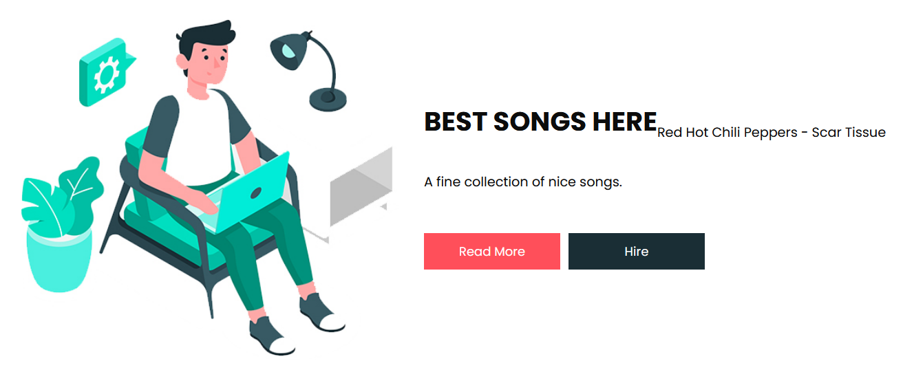

# Labo5 HTTP Web infrastructure

## Project description

The aim of this project, as seen in the [instructions](LABO_INSTRUCTIONS.md) document, is to establish a web
infrastructure containing a
static website, a dynamic HTTP API, and a reverse proxy. To achieve this, we use Java for the API implementation,
employing the `Javalin` framework. The web server was constructed using `nginx`, and for the reverse proxy
functionality, we opted for `traefik`. The entire infrastructure is deployed seamlessly through the assistance
of `docker` and  `docker-compose`. Additionally, the capability to add or remove server instances is facilitated by the 
use of `portainer`.

## Instruction to set up the infrastructure

In order to set up the infrastructure, the following steps must be followed:

1. Open a terminal and navigate to the root directory of the project.
2. If you are on Windows, make sure to open Docker Desktop!
3. Go to the ```docker``` directory, where you can find the docker-compose.yml file, and run the command
```shell
 docker compose up
```
4. Docker should download all the necessary images and build the containers the first time you run it.
5. Once the containers are up and running, you can access the :
    - Static website: http://localhost:8000/ or https://localhost
    - Dynamic API: http://localhost:8000/api/songs or https://localhost/api/songs
    - Traefik dashboard: http://localhost:8080/
    - Portainer dashboard: http://localhost:9000/ or https://localhost:9443/

## Step 1 - Static Web Site

In this step, we created a dockerfile to start the nginx server. We used the official `nginx:latest` image from
dockerhub.
We downloaded a html template containing a static website and added the files to the [nginx](docker/nginx) folder. 
Then, we created a Dockerfile
and a [nginx.conf](docker/nginx/nginx.conf), which is a file used to configure the server listening on port 80 and 
give the files location for the website.
In the [dockerfile](docker/nginx/Dockerfile), we used the `COPY` command to copy the `nginx.conf` file to the container
as well as the website files. We also used the `EXPOSE` command to inform that the container will listen on port 80.
When all of this is done, we can build the image and run the container with the following commands:

```shell
docker build -t mynginx .
docker run -d -p 8080:80 mynginx
```

The website is now accessible at the address http://localhost:8080/. We tried to reach it using a browser (Firefox) and 
it worked.

## Step 2 - Docker Compose

Once the static website is working, we can create a docker-compose file to run the website and the other containers
needed for the rest of the project. We created a [docker-compose.yml](docker/docker-compose.yml) file in the docker
folder.
We added a new service for the static website called `web`. Since we want to be able to rebuild the docker image
of the web server, we added the `build` and `context` commands to the service. The `context` command is used to specify
where the files needed to build the image are located. We also linked the port 80 of the container to the port 8080 of 
the host. Here's the commented code we added to the first docker-compose file:

```dockerfile
services:
  web:
    # When a build subsection is present for a service, Compose ignores the image attribute for the corresponding
    # service, as Compose can build an image from source
    build:
      # context specifies where to find the necessary files to build the image
      context: nginx
      # dockerfile specifies the name of the Dockerfile that contains the steps to build the image within
      # the defined context
      dockerfile: Dockerfile
    ports:
      - "8181:80"
    # volumes allows you to mount a directory from the host into the container
    volumes:
      - ./docker/nginx/website:/var/www/html
```

We can now start and stop the docker compose infrastructure running the following commands inside the directory
containing the docker-compose file:

```shell
docker compose up
docker compose down
```

The image can also be rebuilt using the following command:

```shell 
docker compose build
```

## Step 3 - HTTP API Server

During this phase, we developed the API using the Javalin framework in Java. With Javalin, a server can be created,
enabling the different endpoint routes for the API we made. The API is able to handle GET, POST, PUT and DELETE requests.
The basic concept of our API is to represent a song with a singer and a title. The API communicates usin the JSON format.
The songs and their singer are represented as a class `Song`. The available songs are stored in a `ConcurrentHashMap`,
where the key represents the id of the song.

The different routes are:
- GET /api/songs -> returns all the `Song` contained in the `HashMap`
- GET /api/songs/{id} -> returns a `Song` linked to a specific id
- POST /api/songs -> add a new `Song` to the `HashMap` 
- PUT /api/songs/{id} -> add a new `Song` or modify a song in the `HashMap`
- DELETE /api/songs/{id} -> delete the `Song` with the given id from the `HashMap`

When all the routes were implemented, we built the project with `maven` and created a [Dockerfile](docker/api/Dockerfile) to build the image of the API. 
We used the ` eclipse-temurin:17-jdk-focal` image from dockerhub to build the API with docker.
The jar file from the target folder is copied to the container, which listens on port 7000. The command `java -jar api.jar`
is the ran inside the container.
Finally, in the docker-compose file, we added the api service with the `context` and `dockerfile` commands to 
indicate where to find necessary files to build the image. We also linked the port 7000 of the container to the port 
7000 of the host. You can find the code of the docker-compose file below:

```dockerfile
api:
   build:
      # context specifies where to find the necessary files to build the image
      context: api
      dockerfile: Dockerfile
   ports:
      - "7000:7000"
```

We can now start and stop the API with docker compose. We can access the API while being able to access the static 
website at the same time in a browser. We can also access the API using `Insomnia` or `Postman`. We tested the different
CRUD operations and they worked as expected.

## Step 4 - Reverse Proxy with Traefik

The goal of this step is to place a reverse proxy in front of the dynamic and static Web servers such that the reverse 
proxy receives all connections and relays them to the respective Web server. To do so, we used Traefik as a reverse 
proxy. We added a new service in the docker-compose file called `reverse-proxy` using the traffic docker image. You 
can see below the commented code we added to the docker-compose file. The Traefik dashboard is accessible at 
`http://localhost:8080/`, the static website at `http://localhost:8000/` and the dynamic API at 
`http://localhost:8000/api/songs`. We had to use the port 8000 of the host because the port 80 was not available on
our machines. If the port 80 is available, you can replace the line `"8000:80"` by `"80:80"` in the docker-compose file.

```dockerfile
reverse-proxy:
 image: traefik:v2.10
 # Enables the web UI and tells Traefik to listen to docker
 command: --api.insecure=true --providers.docker --log.level=INFO
 volumes:
   # So that Traefik can listen to the Docker events
   - /var/run/docker.sock:/var/run/docker.sock
 ports:
   # the http port
   - "8000:80"
   # Traefik dashboard
   - "8080:8080"
```

We also had to add some new configuration to the already existing services in the docker-compose file. We added the
Traefik labels to both the static web and api services. 

In the api service, we added the following labels:
```dockerfile
 labels:
     - "traefik.http.routers.api.rule=Host(`localhost`) && PathPrefix(`/api`)"
     - "traefik.http.services.api.loadbalancer.server.port=7000"
```
The first label defines the routing route for Traefik, here `localhost/api` and the second label specifies that 
the service `api` should be exposed on port 7000. Traefik will route the incoming requests to this service on port 7000.

In the web service, we added the following labels:
```dockerfile
 labels:
     - "traefik.http.routers.web.rule=Host(`localhost`) && !PathPrefix(`/api`)"
     - "traefik.http.services.web.loadbalancer.server.port=80"
```
The meaning of the labels is the same as for the api service. The first label defines that the routing route for Traefik
is `localhost` and the second label specifies that the service `web` should be exposed on port 80.

The Traefik dashboard can be accessed at `http://localhost:8080/`. The Traefik dashboard is a web UI that 
provides real-time insights and control over the Traefik proxy's configuration and runtime. It includes features such 
as health status monitoring, configuration visualization, access logs, SSL/TLS certificate information and more.

## Step 5 - Scalability and Load Balancing

The goal of this section is to allow Traefik to dynamically detect several instances of the (dynamic/static) Web 
servers. To do so, we added the `deploy.replicas` instruction to the web and api services in the docker-compose file to 
specify how many instances of each service we need.

In the web service, we added the following instruction:
```dockerfile
 deploy:
   replicas: 3
```
This instruction sets the number of instances of the web service to 3. The same instruction was added to the api service.

To dynamically scale the number of instances of the web and api servers, we used the following command:
```shell
docker compose up -d --scale <service>=<count>
```
Where `<service>` is the name of the service and `<count>` is the number of instances we want to scale to. 

To make sure that the load balancing was working, we launched the docker compose infrastructure, and we could see that 
there was indeed three different instances of the web and api services in the Docker Desktop application. We could also
see that the requests were distributed between the different instances of the web and api services by reading the
Javalin and Docker logs.

## Step 6 - Load balancing with Round-Robin and Sticky Sessions

The goal of this step is to change the configuration such that Traefik uses sticky sessions for the dynamic server 
instances (the API instances) and round-robin for the static web server. To do so, we added two new labels to the api
service configuration in the docker-compose file that you can see below.
```dockerfile
labels:
  - "traefik.http.services.api.loadBalancer.sticky.cookie=true"
  - "traefik.http.services.api.loadBalancer.sticky.cookie.name=api-cookie"
```
The first label enables sticky sessions for the api service and the second label specifies the name of the cookie that
will be used to store the session information. Specifying the cookie name is optional, but it makes it easier to identify
your cookie when you are testing your configuration.

We checked that the round-robin load balancing was working for the static web server by making multiple requests from a
browser (Firefox) and checking the logs. We could see that the response was sent by different instances of the web server, 
as you can see in the screenshot below.


We checked that the sticky sessions were working for the api service by making multiple requests from `Insomnia` by 
verifying that the cookie was the same for all the requests. It was indeed the case, as you can see in the screenshots
below (the cookie value is hashed, but you can see that it is the same).

### Cookie for the first request


### Cookie for the subsequent request


## Step 7 - Securing Traefik with HTTPS

The goal of this step is to configure Traefik to use HTTPS with the clients.

The first step is to generate a self-signed certificate using the openssl command below.
```bash
openssl req -x509 -newkey rsa:4096 -keyout key.pem -out cert.pem -sha256 -days 365
```
Once the certificate and key files are created, we placed them into the folder [certificate](docker/certificate) 
which has to be mounted as a volume in the Traefik container.

The next step is to create a separate Traefik configuration file called [traefik.yaml](docker/traefik.yaml) because the configuration
we have to do cannot be directly done using labels. You can see the commented code of the configuration file below.

```dockerfile
providers:
  # dynamically discovers and configures routes based on Docker containers and services
  docker:
    endpoint: "unix:///var/run/docker.sock"

## Static configuration
# Define http and https entrypoints and their corresponding addresses 
entryPoints:
  http:
    address: ":80"

  https:
    address: ":443"

tls:
  # TLS configuration for HTTPS
  certificates:
    - certFile: /etc/traefik/certificates/cert.pem
      keyFile: /etc/traefik/certificates/key.pem

api:
  # enable Traefik dashboard
  dashboard: true
  # allow insecure connections 
  insecure: true

```

The `reverse-proxy` service in the docker-compose file also had to be updated to mount `traefik.yaml`, the certificate,
the key and to expose the port 443 of the container to the port 443 of the host for the https connection. You can see
these changes below. 

```dockerfile
 volumes:
   # Mounting the certificate and the key
   - ./certificate:/etc/traefik/certificates
   # Mouting the treafik configuration file
   - ./traefik.yaml:/etc/traefik/traefik.yaml
 ports:
   # the https port
   - "443:443"
```

Lastly, we also had to update the web and api services in the docker-compose file to specify that the services should
be exposed on the https entrypoint. Below is the example of the new labels of the web service.

```dockerfile
labels:
  - "traefik.http.routers.secureweb.tls=true"
  - "traefik.http.routers.secureweb.rule=Host(`localhost`) && !PathPrefix(`/api`)"
  - "traefik.http.routers.secureweb.entrypoints=https"
```
The first label ensures that TLS is enabled, the second label defines the routing route for `secureweb` and the last
label association the `secureweb` router to the https entrypoint. We chose to keep the http entrypoint for the web service
because we wanted to be able to access the website with http and https. That's why we have the other name `secureweb`
for the secured version of the web service. We proceeded the same way for the api service.

We can now access the static website at `https://localhost` and the dynamic API at `https://localhost/api/songs`.

## Optional Step 1 - Management UI

As an optional step for this project, we have to implement a dashboard that allows us to monitor and update our web 
infrastructure dynamically. The goal being to list running containers, start/stop them or even add/remove instances.
The option chosen is to use a container called `portainer` which offers a service of a graphical interface to facilitate 
tasks such as container
creation, monitoring and scaling. The configuration is as follows:

```dockerfile
portainer:
    image: portainer/portainer-ce
    # specifying the Docker socket path
    command: -H unix:///var/run/docker.sock 
    ports:
      # port to access portainer web interface with http
      - "9000:9000"
      # port to access portainer web interface with https
      - "9443:9443"
    volumes:
        # Mount the Docker socket from the host into the container
        - /var/run/docker.sock:/var/run/docker.sock
        - portainer_data:/data
        # Mount the directory containing SSL/TLS certificates
        - ./certificate:/certs

volumes:
  portainer_data:
```

The `volume: portainer_data` section allows us to ensure that we can keep data such as configurations or other 
persistent information
in the computer so that they are not erased when we restart or updates containers.
After running the `docker-compose` file, we can access the dashboards at the links http://localhost:9000/ and 
https://localhost:9443/.

We are then able to stop containers or delete them. We can also create new copies/instance of the running servers. We can
see on the pictures the running containers on our device.


## Optional Step 2 -  Integration API - static Website

The goal of this step is to change the static Web page to periodically make calls to the API server and show the 
results in the Web page. We chose to simply display a different song every 4 seconds on the static website. To do so,
we added the following code to the [index.html](docker/nginx/website/index.html) file of the static website.
```html
<div class="api-inject"></div>
```
This adds an empty `div` element and assigns it to the class`api-inject`. 

We then created a new javascript file called `api.js` in the `js` folder of the static website. This file contains the
code that makes the request to the API using the fetch API and displays the result in the `div` element. You can see 
the commented code below.

```javascript
// adapt the url
const urlApi = window.location.origin + "/api/songs"
let index = 1

function fetchSongs() {
// we fetch backend data
    fetch(urlApi).then(response => {
        // we convert them into json
        response.json().then(data => {
            let song = data[index]
            index = (index + 1) % (Object.values(data).length + 1);
            // create new div
            let div = document.createElement('div')
            // we add data to div
            div.innerHTML = `<p>${song.singer} - ${song.title}</p>`
            // we retrieve the div in which we want to inject the data
            const divToInject = document.getElementsByClassName("api-inject")[0]
            divToInject.innerHTML = ""
            // we add the new div to the dom
            divToInject.appendChild(div)
        })
    })
    .catch(error => console.error('Error fetching data:', error));
}

// Call fetchSongs every 4 seconds
setInterval(fetchSongs, 4000)
```

We can now access our static website again and see the songs being displayed every 4 seconds. You can see an example
of the result in the screenshot below.




